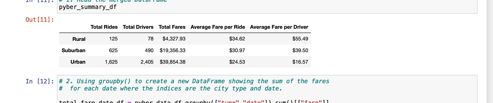
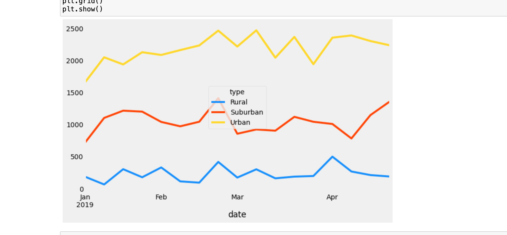

# PyBer_Analysis

## Overview of analysis
Using Python skills and knowledge of Pandas to create a summary DataFrame of the ride-sharing data by city type. Then, using Pandas and Matplotlib to create a multiple-line graph that shows the total weekly fares for each city type. Finally, summarizes how the data differs by city type and how those differences can be used by decision-makers at PyBer.

## Resources
- Data Source: city_data.csv , ride_data.csv
- Software: Python 3.8.3, Jupyter notebook, 6.0.3

## PyBer_Analysis Results:
The analysis of the PyBer_Analysis shows that:
- Acoording to the PyBer_summary_df There are 2405  drivers in Urban cities which is almost 1.5 times more than the total rides and as a result the average fare per driver is as low as $16.57. 
In Rural cities the situation is almost opposit as the total rides are less than two times of drivers which is 78 . so the average fare per driver is $55.49!

- According to the multiple line chart, we have similar trend with small differences during the period of time for three city types. 

## PyBer_Analysis Summary
- Based on summary data for three type of city, it is better to increase the number of drivers in rural cities. Maybe transfering some from urban area to the rural is a good idea.

